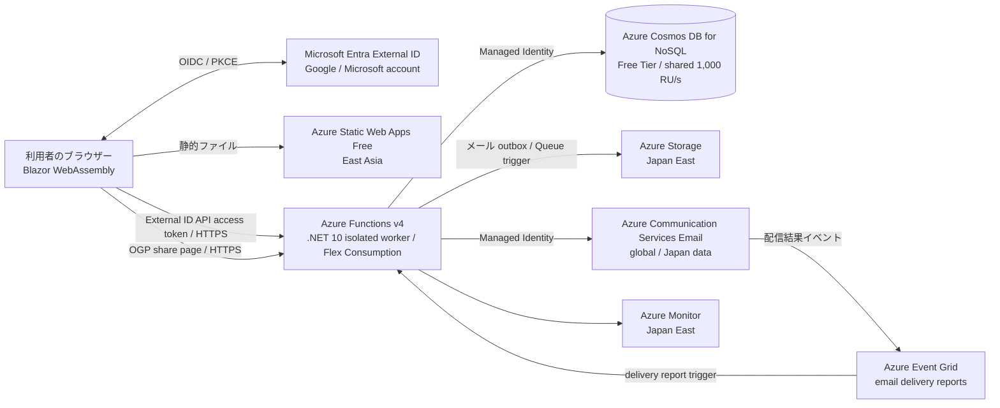

# カンファレンス CFP・運営プラットフォーム設計書

- 状態: 初期設計案
- 更新日: 2026-09-23
- 対象: Blazor WebAssembly、Azure Functions、Azure Cosmos DB を使うカンファレンス運営サービス

## 1. 目的と設計原則

カンファレンス主催者がイベントを作成し、登壇希望者からセッション提案（CFP）を受け付け、審査・採択・タイムテーブル公開までを運営できるサービスを提供する。Fortee 等の CFP 基盤を参考に、募集から公開スケジュールまでの運営機能を一貫して提供する。

設計原則:

1. Azure のフルマネージドサービスを優先し、常時稼働 VM や常時確保する専用サーバーを置かない。
2. 初期は単一リージョン・低〜中程度の不定期トラフィックを想定し、実測に基づいて拡張する。
3. ブラウザーは信頼境界の外に置く。認可、入力検証、業務ルール、データアクセスは API 側で必ず実施する。
4. 主催者・応募者・閲覧者の画面を一つの Blazor WebAssembly アプリにまとめ、API とデータを共有する。
5. 初期リリースは CFP・審査・タイムテーブルの同等機能を優先し、チケット販売・決済等の別領域は本設計の初期対象に含めない。
6. 技術検証では、リージョンを選べる Azure リソースを Japan East (`japaneast`) に配置する。Static Web Apps は Japan East を選べないため East Asia を例外とし、Azure Communication Services は `global` リソースとしてデータ所在地を Japan にする。

## 2. 対象利用者と範囲

| 利用者 | 主な機能 |
|---|---|
| 未ログインの閲覧者 | 公開カンファレンス、募集要項、公開プロポーザル、タイムテーブルの閲覧、SNS 共有 |
| 登壇希望者・スピーカー | Microsoft / Google アカウントでのログイン、プロフィール管理、プロポーザルの下書き・応募・編集・取り下げ、応募状況・通知の確認 |
| カンファレンス管理者 | カンファレンス作成、募集設定、プロポーザル種別・入力項目設定、応募管理、審査・採否決定、メール送信、会場・トラック・タイムテーブル管理、公開 |
| 審査スタッフ | 担当プロポーザルの閲覧、評価・コメント、審査結果の確認（主催者が権限を付与した場合） |

初期リリースで扱う管理範囲は「CFP の募集・選考・通知・日程公開」。来場者チケット販売・決済、スポンサー営業、会場入場管理、動画配信、X API を使った自動投稿は別機能として扱い、要件が確定してから追加する。

## 3. 機能要件

### 3.1 カンファレンス

- 管理者が複数のカンファレンスを作成・編集・複製・アーカイブできる。
- タイトル、説明、ロゴ等の公開情報、開催日時、タイムゾーン、会場、公開 URL、募集開始・締切、問い合わせ先を設定する。
- 会議ライフサイクル、公開可視性、CFP、審査、タイムテーブルの状態を独立して管理する。例: 会議 `Draft / Active / Archived`、可視性 `Private / Public`、CFP の保存状態 `Draft / Published / ManuallyClosed`、審査 `NotStarted / InProgress / Completed`、日程 `Draft / Published`。CFP の画面状態 `Scheduled / Open / Closed` は公開状態・UTC の開始／締切・手動停止からサーバーが算出し、期限到来で保存データを暗黙更新しない。再開は監査付きの明示操作とする。
- 主催者、管理者、審査スタッフをカンファレンス単位で割り当てる。

### 3.2 プロポーザル募集・応募

- カンファレンスごとに複数のプロポーザル種別（例: 20 分トーク、45 分トーク、LT、ワークショップ）を設定できる。
- 種別ごとに応募期間、時間、説明、受付上限、応募フォーム項目、必須・任意、文字数上限、選択肢、公開範囲を定義する。
- 応募者はプロフィールと共同登壇者を登録し、下書き保存、提出、締切前の編集・取り下げができる。
- 申込状態を `Draft / Submitted / UnderReview / Accepted / Rejected / Withdrawn` として管理し、状態変更と操作履歴を記録する。
- 公開プロポーザルの一覧機能は会議単位で有効化できるが、初期値は無効とする。公開は採択済み提案に限り、応募責任者の明示同意（共同登壇者全員の同意を確認した旨を含む）と Organizer による個別公開を必須にする。同意は公開提案、公開タイムテーブル上のセッション詳細、SNS share metadata に適用し、撤回時はこれらすべてから即時に除外する。審査メモ・連絡先・未採択提案は公開 API から返さない。会議の showcase 設定は公開提案一覧の有効・無効だけを切り替える。
- 申込の重複、締切後の変更、権限外の編集をサーバー側で拒否する。

### 3.3 審査・採否

- 主催者が審査担当者を割り当て、審査コメント、採点、推薦、利益相反の申告を記録できる。
- 審査中のプロポーザルは応募者・権限のない管理者から審査メモを隠す。
- 任意でブラインド審査を有効化し、審査画面で応募者名等を伏せる。
- 採否の決定者・日時・理由を監査履歴として記録する。
- 公開お気に入り数等を採否の参考情報にする場合でも、自動的に採否を決定しない。

### 3.4 メール通知

- 応募受付、応募内容更新、審査結果、採択後の連絡等のテンプレートを用意する。
- 個別送信および対象者を選んだ一括送信を行う。宛先・件名・本文・送信者・送信状態を追跡する。
- メールは `Transactional`（受付・採否など）と `ConferenceOperations`（主催者からの任意連絡）に分類する。プロフィールの通知設定・配信抑止を確認し、同意撤回済みの任意連絡には送信しない。マーケティングメールは初期スコープ外とする。
- 配信先は認証 token の未検証 email claim ではなく、アプリで確認済みのプロフィール宛先に限定する。ACS の送信直前にも opt-in と suppression を再確認する。
- メール本文に不要な個人情報や審査メモを含めない。送信前プレビュー、確認、誤送信防止を設ける。
- 送信は非同期化し、再試行、失敗記録、運営者による再送ができるようにする。

### 3.5 タイムテーブル

- 会場、部屋、トラック、休憩・任意枠を管理する。
- 採択セッションを開始・終了時刻、部屋、トラックに割り当て、公開前のプレビューを行う。
- 同一部屋の時間重複、同一セッションの二重配置、セッション時間と枠の不一致を保存時に検出する。
- 公開後の修正履歴を記録し、日時はカンファレンスのタイムゾーンで表示する。
- 公開カレンダー／タイムテーブルとセッション詳細を、ログインなしで閲覧できる。

### 3.6 SNS 連携

- スピーカープロフィールに X 等の外部プロフィール URL を登録できる。
- 公開カンファレンス・プロポーザル・セッションに、公開 URL を使う共有リンクを提供する。
- 初期リリースでは SNS API を使った投稿・OAuth アカウント連携は行わない。外部 API の利用審査・料金・アクセストークン保管・変更追従を避けるためである。
- カンファレンス・公開セッション・公開プロポーザルには SNS crawler が読める OGP metadata 付き共有ページを用意する。共有ページは公開情報のみをサーバー生成 HTML として返し、Blazor の公開画面へのリンクを含める。
- 同意撤回時は自サービスの API・HTML share route から直ちに除外し、share response の cache lifetime は短くする。ただし各 SNS が取得済みの preview cache は即時消去を保証できないことを利用者に明示する。

## 4. 論理アーキテクチャ

### 4.1 フロントエンド

- Blazor WebAssembly を Azure Static Web Apps に配置する。
- Blazor WebAssembly とすべての .NET project は .NET 10 (`net10.0`) を target とする。共通 `Cfp.Contracts` も同じ TFM を使う。
- Static Web Apps の deep link とブラウザー更新を支える SPA navigation fallback を設定する。動的共有 URL は Functions の HTML share endpoint とし、通常の API payload 契約とは分離する。
- Static Web Apps Free の配置リージョンは East Asia とする。静的アセットはグローバル配信されるが、デプロイ構成にはこの例外を反映する。
- 申込画面、公開ページ、管理画面は共通 SPA とし、ルート・表示だけで権限を付与しない。
- UI コンポーネントは Fluent UI Blazor v5 を候補とし、実装時に対象 .NET とパッケージの互換性を確認する。
- Blazor は共通 API client を通じて Functions と通信し、`Cfp.Contracts` の MemoryPack DTO を `application/octet-stream` として送受信する。HTTP API のエラー DTO も同じ形式を使い、画面ごとにシリアライズ処理を実装しない。
- クライアント設定に含めてよいのは公開クライアント ID、テナント情報、API URL 等に限る。秘密鍵、Functions key、Cosmos key、ストレージ接続文字列は含めない。
- API は Functions アプリを独立して配置する。フロントエンドから直接呼び出す場合は、本番・ステージング・ローカル開発の必要な origin だけを Functions の CORS に許可する。MemoryPack payload 用の `Content-Type` / `Accept` と bearer token 用の `Authorization` を許可し、ブラウザーの preflight に対応する。CORS を認証・認可として扱わない。
- Static Web Apps 自身の認証機能は使わず、Blazor から Entra External ID にログインする。Static Web Apps のカスタム認証は Standard プランが必要なため、初期の低コスト構成では採用しない。

### 4.2 API と非同期処理

- Azure Functions v4 の .NET 10 isolated worker (`net10.0`) を採用し、Flex Consumption 上で HTTP trigger の業務 API、Queue trigger のメール送信を実装する。Linux Consumption plan は .NET 10 対象外のため使わない。
- Azure Communication Services Email の配信レポートを Event Grid で `EmailDeliveryReportFunction` に渡す。Event Grid event は provider message ID で outbox と対応付け、重複 event を冪等に処理する。
- HTTP request/response body は `Cfp.Contracts` の MemoryPack DTO をバイナリとして処理する。JSON の Cosmos DB item や Queue message とはシリアライズ境界を分ける。
- Functions の Easy Auth を有効にし、Entra External ID を OIDC プロバイダーとして登録する。Blazor は API 用 audience のアクセストークンを取得して送信し、Easy Auth が署名・issuer・audience 等を検証する。
- Easy Auth の custom OIDC provider では、受け付けるトークンの audience はプロバイダー登録の client ID に一致させる。`infra/main.bicep` の `externalIdApiClientId` には API 用アプリ登録の ID を渡し、別の audience 許可リストがある前提にしない。
- CFP やタイムテーブルの公開 GET API を匿名で使えるよう、Easy Auth の未認証時動作は `Allow anonymous requests` とする。この設定では未認証リクエストもアプリに到達するため、応募・管理 API は Functions 側で認証済み principal を必須とする。Easy Auth が検証した principal 情報だけを使用し、クライアント由来のユーザー ID・ロール情報を認証根拠にしない。
- Easy Auth をアプリ全体で未認証拒否に設定する場合は公開 API も拒否されるため、公開 API を別アプリに分離する等の設計変更を別途行う。API の未認証動作と Flex Consumption 上での設定は技術検証で確認する。
- API はバージョン付き REST/HTTP（例: `/api/v1/me/conferences/{conferenceId}/proposals`）とし、request/response body は MemoryPack バイナリ形式にする。Cosmos DB 文書はクエリ可能な JSON のまま保持する。
- Functions Flex Consumption を初期候補にする。scale-to-zero と実行量ベースの課金を活用し、always-ready instance は初期設定しない。
- 書き込みはサーバーで認証・認可・検証し、更新競合には ETag 等を使う。重複送信や二重応募を避けるため、重要な作成 API は idempotency key またはサーバー側重複検査を設ける。
- メール通知の業務イベントを Cosmos DB の outbox として記録し、change feed trigger から Queue Storage に渡す。Queue message は partition key を含む `{ conferenceId, outboxId }` のみとし、Queue trigger が outbox を point read して ACS Email へ送信する。処理は少なくとも一度実行され得るため、outbox ID で重複処理を抑止し、失敗を poison queue と監視アラートで扱う。メールの「送信受付」と「受信者への配信成功」は区別する。
- 外部 Azure サービスへの接続に managed identity を使い、アプリケーション内の秘密を最小化する。Functions の実行に必要なホスト用 Storage Account は別途必要。

## 5. 認証・認可・セキュリティ

### 5.1 認証

- Microsoft Entra External ID の外部テナントを顧客・利用者向け認証基盤として使用する。
- Google を外部テナントのソーシャル IdP として設定する。
- Microsoft 個人アカウントは OIDC IdP として連携する。Microsoft Entra External ID の外部テナントでの登録方法・redirect URI・発行 claim を実環境で検証することを実装着手条件とする。
- Blazor WebAssembly の browser-delegated authentication を使い、OIDC Authorization Code + PKCE でログインし、API 用 audience のアクセストークンを取得する。トークンの検証は Functions の Easy Auth に任せる。
- メールアドレスだけを永続的なユーザー識別子として扱わない。外部 ID の issuer と subject をアカウント識別に利用し、複数 IdP の同一利用者アカウント統合は明示的な再認証フローで行う。
- メール配信先として使うアドレスは External ID の検証済み claim またはアプリの確認フローで別途検証し、未確認アドレスには送信しない。

### 5.2 認可

- 初期アプリ内のロールは `ConferenceOwner`, `Organizer`, `Reviewer`, `Speaker` とし、すべて会議単位に限定する。プラットフォーム運用者の特権は顧客向けアプリに持ち込まず、Azure RBAC による運用分離とする。
- `ConferenceOwner` は会議運営全般・スタッフ管理・所有者移譲を行う。`Organizer` は募集、応募、審査・採否、日程、運営メール、監査履歴を管理するが、membership は変更できない。`Reviewer` は割当済み提案だけを審査し、`Speaker` は本人のプロフィール・応募・公開同意を管理する。
- Easy Auth は認証・トークン検証を担い、Functions の業務ロジックは認証済み主体から user ID を特定して対象 conference の membership を Cosmos DB で確認する。ブラウザーから送信された role 名や `conferenceId` のみを信頼しない。
- 会議には有効な `ConferenceOwner` を常に1名以上残す。所有者移譲を先に完了しない限り、最後の owner の削除・降格を拒否する。
- 公開読取 API は明示的な公開フィールドのみ返す。管理操作、応募者データ、審査情報は個別に認可する。
- Function key をログイン・ユーザー認証の代わりに使わない。認証済み access token を要求する API に function-level shared key を混ぜない。

### 5.3 データ保護

- HTTPS を必須とし、保存時暗号化、Azure RBAC、必要最小限の managed identity 権限を用いる。
- メール、プロフィール、非公開提案、審査メモは個人情報として扱う。本文・アクセストークン・認証情報をログに出さない。
- 各カンファレンスのデータ閲覧範囲、公開前情報、削除・エクスポート依頼への運用手順を定義する。
- API 境界で body サイズ・ページサイズ・フォーム schema 上限を強制し、認証済み利用者単位の応募制限と管理者メール送信の件数確認・再確認を実装する。HTML のサニタイズ、CSRF/redirect の検査、監査ログも API 境界で扱う。全体・IP 単位の DDoS 対策はアプリの利用状況に応じて別途判断する。
- Blazor は標準 OIDC/MSAL の Authorization Code + PKCE を使い、confidential secret を持たない。token cache はブラウザー session の範囲に制限し、CSP、依存 package 更新、XSS 対策をリリース条件に含める。
- ユーザー削除時は、法的・運用上保持が必要な監査情報と、削除・匿名化するプロフィール情報を区別する。

## 6. Cosmos DB データ設計

### 6.1 アカウントとコンテナー

- Cosmos DB for NoSQL を採用する。API とデータ操作は Functions 内に閉じ、ブラウザーから Cosmos DB に接続させない。
- Cosmos DB の業務 item は JSON document として保存・検索する。MemoryPack は Blazor–Functions の HTTP wire format 用であり、Cosmos item をバイナリ化して JSON document に埋め込まない。
- コンテナー案:

| コンテナー | パーティションキー | 主なアイテム |
|---|---|---|
| `conferenceData` | `/conferenceId` | 会議、募集種別、応募、審査、権限、タイムテーブル、メールキャンペーン／recipient outbox、監査 |
| `conferenceDirectory` | `/slug` | 公開 URL slug、`conferenceId`、公開カタログ用 projection |
| `userProfiles` | `/userId` | SpeakerProfile、通知設定 |
| `identityDirectory` | `/identityKey` | 外部 IdP の issuer/subject のハッシュから内部 `userId` への対応 |
| `emailDeliveryDirectory` | `/providerMessageId` | ACS provider message ID から conference/outbox への配信レポート lookup |
| `functionLeases` | `/id` | Cosmos DB change feed processor 用の Functions lease |

- 会議単位での読書き・権限検査・集計を基本アクセスパターンとし、`conferenceId` を業務データのパーティションキー候補とする。
- 同一カンファレンス内で整合性が必要な複数書き込み（応募と outbox 作成等）は、同一パーティション内の transactional batch を検討する。複数パーティション・複数コンテナーをまたぐ ACID transaction は前提にしない。
- 公開会議一覧は `conferenceDirectory` に公開項目だけの read projection を保持する。その他の会議横断検索は初期はページング付きクロスパーティションクエリとし、件数・RU 消費が増えた段階で用途別 read model を追加する。
- `conferenceData` のドキュメントは `id`, `conferenceId`, `type`, `schemaVersion`, `createdAtUtc`, `updatedAtUtc`, `createdBy` 等を持つ。可変フォーム回答にはサーバー側 schema version を含める。
- 審査担当者・応募者・公開閲覧者のフィールドアクセスを分離し、コンテナー単位のクエリ結果をそのまま API 応答にしない。
- コンテナーごとのアイテム定義、アクセスパターン、更新・整合性規則は [Cosmos DB データモデル設計](database-design.md) にまとめる。

### 6.2 初期スループット選定

- 技術検証では Cosmos DB Free Tier を有効にしたプロビジョニング済みスループットを使う。6 コンテナーが共有するデータベーススループットを 1,000 RU/s とし、Japan East の単一リージョンで開始する。
- Free Tier はアカウントあたり最初の 1,000 RU/s・25 GB を無料とするが、上限を超えたスループット・ストレージは課金される。サブスクリプションごとに対象アカウントは 1 つで、作成時の有効化が必要。Free Tier と serverless は併用できないため、技術検証環境では serverless を使わない。
- 技術検証後は RU charge、429 throttling、ストレージ量、クロスパーティションクエリを計測し、Free Tier を継続するか provisioned/autoscale throughput・serverless と比較する。クエリやフォーム構造を本番相当のデータで測定してからインデックスを絞る。
- TTL、複数リージョン、private endpoint、continuous backup は無条件に追加しない。保持期間、RPO/RTO、法令、ネットワーク要件が確定してから費用と運用を判断する。
- パーティションキーやコンテナー構造の変更は将来の移行計画（新コンテナー作成、backfill、cutover、rollback）を伴う。

## 7. メール配信

- Azure Communication Services Email をトランザクションメールサービスとして使用する。独自ドメインから送る本番運用では、送信ドメインの所有確認と SPF/DKIM 等の設定を完了する。
- Functions が Azure Queue Storage に登録したメールジョブを非同期に処理し、Azure Communication Services Email SDK で送信する。
- API 応答はメールの実配信を待たず、業務操作・outbox 記録の結果を返す。`Accepted` は ACS が受付した状態であり、配送成功ではない。Event Grid の delivery report で `Delivered / Bounced / Suppressed / FilteredSpam / Quarantined / Failed` を更新する。`Delivered` は受信者側 mail transfer agent への引き渡しを表し、受信箱への到達や開封を保証しない。
- 個別通知は recipient ごとの outbox item とする。一括送信は campaign とし、応募状態・宛先・送信者・本文をプレビュー後に固定する。現行 MVP は最大50人の campaign を ETag／operation ID 付きの単一 transactional batch で登録し、campaign・recipient outbox・監査イベントを原子的に作成する。上限を超える場合は送信を拒否し、規模を拡大する際に段階 fan-out と進捗復旧を設計する。
- Delivery report は provider message ID で引き当て、Event Grid event ID と処理済み状態を保存して重複配信に耐える。宛先の hard bounce / suppression は抑止リストへ反映し、Poison Event の監視・再処理手順を設ける。
- worker は ETag 条件で outbox を `Ready → Sending` に取得し、attempt ID と lease 時刻を記録してから ACS を呼ぶ。期限切れの `Sending` は重複送信を避けるため `Unknown` とし、自動再送しない。一時障害で未受付を確認できた場合だけ backoff 後に `Ready` へ戻し、恒久エラー・上限到達は poison queue に隔離する。個別再送には監査ログを残す。
- 大量配信を開始する前に利用制限、送信可能数、独自ドメイン審査、配信停止・バウンスの扱いを確認する。

## 8. 可用性・監視・運用

- 開発・ステージング・本番で Entra tenant/app、Functions、Cosmos DB、Storage、ACS Email の設定・リソースを分離する。本番データを下位環境へ複製しない。
- Bicep と GitHub Actions で環境ごとの resource/config/RBAC/Event Grid subscription を再現可能にする。Event Grid subscription は trigger function のデプロイ後に適用する第二段階 IaC とし、ACS の送信権限も手作業だけに依存させない。
- GitHub Actions の Azure federated credentials（OIDC）でデプロイし、publish profile や長期共有シークレットに依存しない。
- Azure Monitor / Application Insights で API 失敗率、応答時間、Functions 実行、Cosmos RU・429、メール処理の滞留・失敗を監視する。ログのサンプリング・保存期間と個人情報の除外を設計する。
- 予算アラートとサービス別の月次コスト確認を有効にし、負荷上昇・メール急増・クロスパーティションクエリの増加に気づけるようにする。
- Cosmos DB のバックアップ方式と保持期間は RPO/RTO に基づいて選び、実際の復旧演習を行う。最初は単一リージョンとし、可用性要件が固まるまでは multi-region や常時稼働リソースを追加しない。
- 本番化前に、proposal/review/profile/outbox/audit ごとの retention、本人からの export/delete 要求、削除後に残す監査情報の範囲を決定し、Functions の再実行可能な削除・匿名化手順と復旧後のアクセス停止手順を用意する。
- デプロイ時のスキーマ変更は後方互換を保って段階適用する。破壊的な本番データ移行をアプリ起動時に自動実行しない。
- 技術検証用の Azure リソース定義は `infra/main.bicep` に置く。Japan East の Functions、Storage、Cosmos DB、Log Analytics、Application Insights と、East Asia の Static Web Apps を作成する。ACS Email は `global` リソースで作成し、データ所在地を Japan にする。
- Bicep は Cosmos DB Free Tier を有効化し、6 コンテナーが共有するデータベーススループットを 1,000 RU/s に設定する。Free Tier 対象アカウントがサブスクリプションに既に存在する場合は、デプロイ前に利用可否を確認する。
- Entra External ID の API アプリケーション ID と OIDC メタデータ URL は環境固有のため、Bicep の必須パラメーターとして渡す。認証設定は公開 API を維持するため未認証リクエストを許可し、保護対象 API の認可は Functions 内で行う。
- `infra/main.bicep` はコアリソース、6 container、Storage/Cosmos DB の data-plane RBAC、ACS Email Sender role assignment を作成する。`emailSenderAddress` は Azure-managed domain の provisioning 後に指定する。Event Grid subscription は Function の公開後に `infra/email-events.bicep` を第二段階で適用する。External ID のアプリ登録・redirect URI と Static Web Apps へのアプリ配置も別途必要である。
- Event Grid subscription を作成する前に `Cfp.Functions` を発行し、`EmailDeliveryReportFunction` が Functions host に登録されていることを確認する。配信レポートの Event Grid 再試行・dead-letter は Azure 環境で構成・監視する。
- Azure に反映する前に、対象サブスクリプションで `az deployment group what-if --resource-group <resource-group> --template-file infra/main.bicep --parameters externalIdApiClientId=<api-client-id> externalIdMetadataUrl=<metadata-url>` を実行して変更内容を確認する。

## 9. コスト方針

低コストにするため、初期構成は以下を基本とする。

| 領域 | 初期案 | コスト上の注意 |
|---|---|---|
| 静的 Web ホスティング | Azure Static Web Apps Free から検討 | custom domain、SLA、帯域、preview 環境などの制約が要件を満たすか確認。必要なら Standard に上げる。 |
| HTTP / Queue 処理 | Azure Functions Flex Consumption | scale-to-zero、always-ready なしで開始。実行時間、メモリ、実行数、ストレージ課金を監視。 |
| 業務データ | Cosmos DB for NoSQL Free Tier | プロビジョニング済み共有スループットを 1,000 RU/s に設定。1 アカウント / サブスクリプション等の Free Tier 条件を満たす必要があり、無料上限を超えた利用分は課金される。 |
| メール | Azure Communication Services Email | 送信件数、宛先数、送信データ量、独自ドメイン要件で変わる。 |
| 配信イベント | Azure Event Grid | ACS の配信レポート件数に応じる。購読・再試行・dead-letter 保存の構成と event 数を見積りに含める。 |
| 非同期キュー・Functions host storage | Azure Storage | Queue、Functions の実行・ホスト要件に必要な最小構成を使う。冗長性・トランザクション量で変動。 |
| 監視 | Azure Monitor / Application Insights | 保持期間、取り込み量に予算上限を設け、PII を含めず必要な粒度を記録する。 |

現時点では月間利用者、応募数、メール通数、データ保持期間が未確定のため月額固定見積りは出さない。リリース前に Azure Pricing Calculator で最低・通常・ピークの3シナリオを作成し、Azure Budget の通知額を設定する。Azure Static Web Apps Free や Cosmos DB Free Tier 等の無料枠を本番 SLA や将来の無償継続の保証とは見なさない。

初期は Azure Front Door、API Management、Redis、Service Bus、常時稼働 App Service、複数リージョンを導入しない。必要性が測定・合意された場合に追加する。

## 10. UX・アクセシビリティ

- 応募・管理の主要操作をキーボードのみで完了できること、明確なフォーカス表示、適切な見出し・ランドマークを保証する。
- フォームには可視ラベル、入力制約、エラーと修正方法を示し、入力値を失わずに再提出できるようにする。
- 送信中、保存済み、応募完了、メール失敗等の状態を画面表示し、必要な動的状態を支援技術に通知する。
- 色のみで採否・エラー・選択状態を表現しない。日本語の長文、全角・半角、狭い画面、拡大表示、reduced motion を考慮する。
- 実装後に WCAG 2.2 AA を目安として自動検査とキーボード・スクリーンリーダーでの手動確認を行う。UI ライブラリの採用のみで適合済みとは見なさない。

## 11. 実装フェーズ

1. **技術検証**: .NET 10 Blazor の SPA deep link、共有ページの OGP、Entra External ID の Google / Microsoft 個人アカウント連携、Functions Easy Auth、Cosmos DB Free Tier、ACS Email と Event Grid delivery report を検証する。
2. **CFP MVP**: 認証、Conference/ProposalType 設定、公開募集ページ、応募・編集・取り下げ、応募受付メール、管理者ロール。
3. **審査・採択**: Reviewer 割当、評価・コメント、採否、応募者向け通知、監査履歴。
4. **タイムテーブル**: Rooms/Tracks、競合チェック、採択セッション配置、公開スケジュール。
5. **拡張**: プロポーザル検索・お気に入り、複数形式エクスポート、カレンダー連携、追加 SNS 連携、利用状況に基づく RU・コスト最適化。

実装済みのプロジェクト構成・ローカル起動条件・現在の API 範囲は、リポジトリルートの `README.md` を参照する。設計上の Azure tenant / resource 検証は、コード build と分けて記録する。

## 12. 実装開始前に決める項目

- Japan East を標準リージョンとし、Static Web Apps は East Asia、ACS は global / Japan データ所在地とする。日本語以外の対応要否。
- 月間カンファレンス数、ピーク応募数、応募ごとの平均サイズ、メール送信数。
- お気に入り・匿名審査をカンファレンス設定として有効化するか。
- データ保持・ユーザー削除・監査ログの保持期間、バックアップからの復旧目標。
- カスタムドメイン数、サービス可用性目標、Static Web Apps Free の制限許容度。
- Microsoft 個人アカウントの OIDC issuer / claims と External ID の設定方法を実 tenant で確認する。
- Google / Microsoft の email verification claim が External ID 経由でどのように保証されるかを確認する。確認できない場合はアプリの確認フローを追加するまで、その宛先へのメール送信を許可しない。
- ユーザーが同じメールアドレスで Google と Microsoft の両方からログインした場合のアカウント統合ポリシー。

## 13. 参照資料

- [画面設計](screen-design.md)
- [Azure Functions クラス設計](function-class-design.md)
- [Microsoft Entra External ID: Identity providers for external tenants](https://learn.microsoft.com/entra/external-id/customers/concept-authentication-methods-customers)
- [Microsoft Entra External ID: Add Google as an identity provider](https://learn.microsoft.com/entra/external-id/customers/how-to-google-federation-customers)
- [Microsoft Learn: Secure ASP.NET Core Blazor WebAssembly](https://learn.microsoft.com/aspnet/core/blazor/security/webassembly/)
- [Azure Static Web Apps overview](https://learn.microsoft.com/azure/static-web-apps/overview)
- [Azure Static Web Apps authentication and authorization](https://learn.microsoft.com/azure/static-web-apps/authentication-authorization)
- [Azure App Service / Functions authentication and authorization (Easy Auth)](https://learn.microsoft.com/azure/app-service/overview-authentication-authorization)
- [Configure an OpenID Connect provider for Azure Functions](https://learn.microsoft.com/azure/app-service/configure-authentication-provider-openid-connect)
- [Azure Functions Flex Consumption plan](https://learn.microsoft.com/azure/azure-functions/flex-consumption-plan)
- [Azure Functions .NET isolated worker](https://learn.microsoft.com/azure/azure-functions/dotnet-isolated-process-guide)
- [Azure Cosmos DB serverless](https://learn.microsoft.com/azure/cosmos-db/serverless)
- [Azure Cosmos DB Free Tier](https://learn.microsoft.com/azure/cosmos-db/free-tier)
- [Manage Azure Cosmos DB for NoSQL resources with Bicep](https://learn.microsoft.com/azure/cosmos-db/manage-with-bicep)
- [Automate function app resource deployment to Azure](https://learn.microsoft.com/azure/azure-functions/functions-infrastructure-as-code)
- [Use Azure Cosmos DB change feed with Azure Functions](https://learn.microsoft.com/azure/cosmos-db/change-feed-functions)
- [Azure Queue Storage trigger for Azure Functions](https://learn.microsoft.com/azure/azure-functions/functions-bindings-storage-queue-trigger)
- [Azure Communication Services Email overview](https://learn.microsoft.com/azure/communication-services/concepts/email/email-overview)
- [Azure Communication Services Email events](https://learn.microsoft.com/azure/event-grid/communication-services-email-events)
- [Azure Communication Services Email pricing](https://azure.microsoft.com/pricing/details/communication-services/)
- [Azure Pricing Calculator](https://azure.microsoft.com/pricing/calculator/)
- [Fortee: PHP カンファレンス関西 2026 CFP 公開例](https://fortee.jp/phpcon-kansai2026/speaker/proposal/cfp)
- [W3C WAI: WCAG 日本語](https://www.w3.org/WAI/standards-guidelines/wcag/ja)
