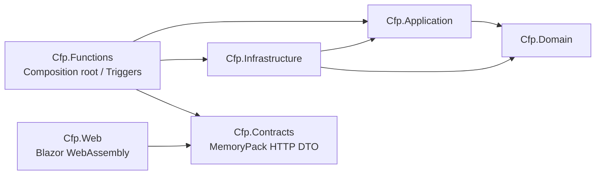
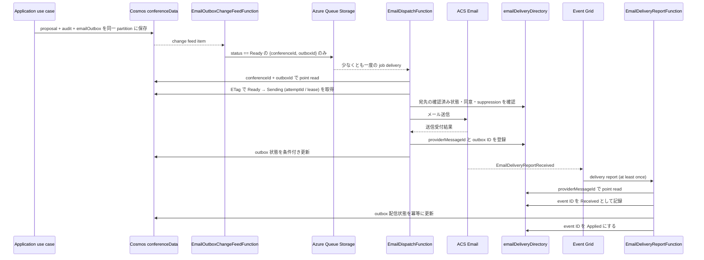

# Azure Functions クラス設計

- 状態: 初期設計案
- 対象: Azure Functions .NET isolated worker、HTTP API、メール outbox 非同期処理
- 関連: [全体アーキテクチャ](architecture.md)、[Cosmos DB データモデル](database-design.md)、[画面設計](screen-design.md)
- 方針: Clean Architecture の依存方向を守り、Functions を入出力アダプター、Application をユースケース、Domain を業務ルール、Infrastructure を Azure 実装として分離する。

## 1. 前提と設計原則

- 既存リポジトリには Functions の `.csproj`、`Program.cs`、実装コードがない。ここでのプロジェクト名・クラス名は実装時に採用する設計案であり、既存実装の記述ではない。
- すべての .NET project は `net10.0` を target とし、Functions v4 の isolated worker と Flex Consumption を使う。Microsoft Learn で .NET 10 は Functions v4 isolated の GA と確認済み。Linux Consumption plan は .NET 10 をサポートしない。
- .NET 10 用の package floor は `Microsoft.Azure.Functions.Worker` 2.50.0 以上、`Azure.Functions.Sdk` 1.0.0 以上。実装時に最新の互換 package と binding extension の組み合わせを確定する。
- Azure Functions は HTTP、Cosmos DB change feed、Queue trigger の起動・変換を担当し、業務判断を持たない。
- Application と Domain は Azure SDK、Functions binding、HTTP 型、Cosmos DB SDK に依存しない。
- `IRepository<T>`、汎用メッセージバス、MediatR 等の追加は初期設計に含めない。ユースケース単位のクラスと Cosmos DB の transaction boundary を表す port を使う。
- Blazor WebAssembly は API DTO を通じて Functions API を利用する。Cosmos DB、Storage、ACS への直接接続や秘密情報の保持は行わない。

## 2. プロジェクトと依存方向



`A --> B` は「A が B を参照する」を表す。`Cfp.Domain` と `Cfp.Contracts` は他プロジェクトに依存しない。Infrastructure は Application の port を実装し、Functions の `Program.cs` が実装を組み立てる。

```text
src/
  Cfp.Domain/
    Conferences/
    Proposals/
    Reviews/
    Scheduling/
    Shared/
  Cfp.Application/
    Abstractions/
    Authorization/
    Conferences/
    ProposalTypes/
    Proposals/
    Reviews/
    Scheduling/
    Notifications/
  Cfp.Infrastructure/
    Cosmos/
    Queue/
    Email/
    DependencyInjection.cs
  Cfp.Functions/
    Http/
    Serialization/
    Triggers/
    EmailEvents/
    Security/
    Hosting/
    Program.cs
  Cfp.Contracts/
    V1/
      Conferences/
      Proposals/
      Reviews/
      Scheduling/
      Notifications/
  Cfp.Web/
    Api/
tests/
  Cfp.Domain.Tests/
  Cfp.Application.Tests/
  Cfp.Functions.Tests/
  Cfp.Contracts.Tests/
```

`Cfp.Contracts` は HTTP wire format 専用で、Domain entity や Cosmos item を公開しない。request/response DTO は `[MemoryPackable(SerializeLayout.Explicit)]` を付けた `partial` 型とし、各 member に固定した `[MemoryPackOrder(n)]` を与える。Blazor と Functions は同じ契約 assembly を参照するが、Blazor は Functions 実装プロジェクトを参照しない。

## 3. 層ごとのクラス

### 3.1 `Cfp.Domain`

| クラス／型 | 責務 |
|---|---|
| `Conference` | 会議の基本情報、公開状態、募集・開催期間、タイムゾーンを保持し、許可された状態遷移を検証する。 |
| `ConferenceLifecycleState` / `ConferenceVisibility` | 会議の運用ライフサイクルと公開可否を独立して表す。 |
| `CfpState` / `ReviewCycleState` / `SchedulePublicationState` | 募集、審査、タイムテーブル公開の独立した状態遷移を表す。 |
| `ProposalType` / `ProposalFormVersion` | 募集種別と不変なフォーム版を表す。フォームの必須・制約定義を保持する。 |
| `Proposal` | 応募本文、所有者、状態、フォーム版、提出状態を保持する。 |
| `ProposalPublicationPolicy` | 採択状態、応募責任者の明示同意（共同登壇者全員の同意確認を含む）、Organizer 公開操作をすべて満たす場合だけ提案を公開可能にする。公開提案一覧の会議 showcase 設定は query 側で別途検証する。 |
| `Review` / `ReviewerAssignment` | 審査内容、担当、利益相反状態を表す。 |
| `ScheduleSlot` / `SchedulePlan` | 採択提案の時間・部屋・トラックへの配置を表す。 |
| `ConferenceRole` / `UserId` 等の value object | ロールと内部 ID を型で区別し、無効な値を境界で排除する。 |
| `ConferenceMembership` | 内部ユーザーと会議単位のロール・有効状態を表す。 |
| `ProposalStatePolicy` | Draft、Submitted、UnderReview、Accepted、Rejected、Withdrawn 間の許可遷移を定義する。 |
| `ScheduleConflictPolicy` | 同一部屋の時間重複、同一提案の二重配置、提案時間との不一致を判定する。 |

Domain は時刻、状態遷移、値の妥当性等の純粋な業務ルールを持つ。Cosmos の保存形式、HTTP status code、Easy Auth claim の読み取りは持たない。

### 3.2 `Cfp.Application`

各 use case は `I...` handler interface と request/result 型で表現してよいが、初期は個別クラスを直接 DI し、共通 mediator framework は導入しない。

| ユースケースクラス | 主な操作 |
|---|---|
| `CreateConferenceHandler` / `UpdateConferenceHandler` | 会議を作成・編集する。新規作成者を初期 `ConferenceOwner` とし、会議本体と membership を同じ conference partition に作成する。slug directory 更新は再実行可能な段階処理にする。 |
| `GetPublicConferenceHandler` / `ListPublicConferencesHandler` | 公開 projection のみを取得する。 |
| `GetPublicScheduleHandler` / `GetPublicSessionHandler` | 公開済みの日程から、採択・同意・個別公開条件を満たすセッション情報だけ取得する。 |
| `GetPublicProposalTypesHandler` | 公開中の募集種別と応募条件を取得する。 |
| `ListPublicProposalsHandler` / `GetPublicProposalHandler` | 一覧は会議の showcase と提案ごとの公開同意・公開状態を検証する。詳細は公開同意・公開状態を検証し、公開済み提案の DTO だけを返す。 |
| `ListManagedConferencesHandler` / `GetConferenceOperationsSummaryHandler` | membership が有効な会議一覧と運営概要を返す。会議をまたぐ運用者向け機能は初期スコープ外とする。 |
| `GetSpeakerProfileHandler` / `UpdateSpeakerProfileHandler` | `userProfiles` の本人プロフィールを取得・更新する。 |
| `ListConferenceMembersHandler` / `ManageConferenceMembershipHandler` | 会議メンバーを一覧し、ConferenceOwner によるロール変更・所有者移譲を行う。最後の owner を削除・降格させない。 |
| `GetConferenceProposalTypesHandler` / `SaveProposalTypeHandler` | 募集種別と不変フォーム版を取得・管理する。 |
| `SaveProposalDraftHandler` / `UpdateProposalHandler` / `SubmitProposalHandler` | 下書きを保存し、本人の応募を更新する。提出済み応募の編集は締切前に限り状態を維持し、提出時は締切・募集状態・フォーム版を再検証する。 |
| `SetProposalPublicationConsentHandler` / `SetProposalPublicationStateHandler` | 採択提案に対する応募責任者の同意・撤回と、Organizer による公開・非公開を監査付きで処理する。同意撤回時は同じ会議 partition 内で公開を解除する。 |
| `WithdrawProposalHandler` | 締切・現在状態・所有者を再検証して本人の応募を取り下げ、監査履歴を残す。 |
| `GetMyProposalHandler` / `GetConferenceProposalHandler` / `ListMyProposalsHandler` / `ListConferenceProposalsHandler` | 応募者本人または会議の認可済みスタッフ向け詳細・一覧を返す。 |
| `ListMyReviewAssignmentsHandler` / `AssignReviewersHandler` / `SubmitReviewHandler` | 担当一覧、担当割当、利益相反、審査提出を処理する。 |
| `DecideProposalHandler` | 採否と理由を確定し、監査イベント・通知 outbox を同じ会議パーティションに記録する。 |
| `GetConferenceScheduleHandler` / `SaveScheduleDraftHandler` / `PublishScheduleHandler` | 会議の日程を取得し、配置競合を検証して保存・公開する。 |
| `ListConferenceAuditEventsHandler` | 認可済み会議の監査履歴をページングして返す。 |
| `PreviewTargetedEmailHandler` / `SendTargetedEmailHandler` / `EmailManagementFunctions.GetEmailHistory` | 送信者・宛先・件数・送信内容のプレビュー、recipient user ID ごとの outbox を持つ campaign 作成、送信状態の取得を行う。送信前に対象者 snapshot を固定し、送信時にも任意連絡への同意・配信抑止を確認する。 |
| `EnqueueEmailOutboxItemHandler` | change feed の outbox 変更を Queue job に変換する。 |
| `DispatchEmailOutboxItemHandler` | Queue job から outbox を取得し、ETag 条件付きで `Ready → Sending` を取得して attempt ID / lease を保存した後に送信する。lease 切れの `Sending` は `Unknown` にし、自動送信しない。 |
| `HandleEmailDeliveryReportHandler` | Event Grid event の source/type/status を検証し、provider message ID から outbox を解決して ETag 条件付きで冪等更新する。`Accepted` による terminal 状態の上書きを防ぎ、矛盾する terminal event は anomaly として記録する。 |

Application は `Actor`（認証済み主体から解決した内部 `UserId` と必要なロール）を明示的な入力として受け取る。公開 query は actor を要求しない。アプリケーション層の認可結果を UI の表示状態だけで代用しない。

`ConferenceAuthorizationService` は `IConferenceMembershipReader` と審査割当情報を使い、会議単位の role・対象提案の割当を検証する。Function class ごとにロール判定を重複実装しない。

| 会議ロール | 権限 |
|---|---|
| `ConferenceOwner` | 会議の全運営操作、スタッフ管理、owner 移譲、会議のアーカイブ |
| `Organizer` | CFP・応募・審査割当と採否・日程・会議運営メールの管理、監査履歴の閲覧。membership と owner 移譲は不可 |
| `Reviewer` | 有効な割当がある提案の審査のみ |
| `Speaker` | 自分のプロフィール・提案・公開同意の管理 |

ロールのない公開閲覧者は公開 API のみ利用できる。本人操作は ownerUserId、Reviewer 操作は会議 membership と提案 assignment の両方を検証する。

### 3.3 Application ports

汎用 CRUD repository ではなく、ユースケースと transaction boundary に沿った port を定義する。

| Port | 責務・境界 |
|---|---|
| `IConferenceReader` / `IConferenceWriter` | 会議の参照・作成・ETag 付き更新。`conferenceDirectory` をまたぐ操作は段階処理と冪等な再実行として表す。 |
| `IProposalQueries` | 会議内応募一覧、応募者本人の一覧、提案詳細を、ページングと認可範囲付きで読む。 |
| `IProposalSubmissionWriter` | proposal、audit event、必要な email outbox を同一 `conferenceId` の transactional batch で保存する。 |
| `IProposalPublicationStore` | proposal の consent / publication state と audit event を会議 partition の transactional batch で更新する。 |
| `IReviewStore` | 審査割当・審査記録を読み書きし、提案・会議の権限確認に必要な情報を提供する。 |
| `IScheduleStore` | 会議単位で日程を取得・更新し、ETag／schedule revision を使って同時編集を検出する。 |
| `IConferenceMembershipReader` / `IConferenceMembershipWriter` | 利用者の conference-scoped role と有効状態を取得し、ConferenceOwner による変更を保存する。 |
| `IAuditEventReader` | 会議 ID を必須として監査イベントを時刻順にページング取得する。 |
| `IUserProfileStore` | 内部 `UserId` をキーとして本人プロフィールを読み書きする。 |
| `IUserIdentityDirectory` | 検証済み issuer + subject から内部 `UserId` を解決する。メールアドレスを主キーにしない。 |
| `IEmailRecipientPolicy` | recipient user ID から確認済み宛先・通信設定・suppression を解決し、送信直前に通信カテゴリ別の許可を判定する。 |
| `IEmailOutboxStore` | `(conferenceId, outboxId)` で outbox を point read し、ETag 条件付き状態遷移、attempt ID / lease 管理を行う。管理画面の履歴は会議パーティション内でページング取得する。 |
| `IEmailDeliveryDirectory` | provider message ID から `(conferenceId, outboxId)` を point read し、Event Grid event ID を `Received / Applied` で記録して部分失敗を再開可能にする。 |
| `IEmailJobPublisher` | PII を含まないメール job を Azure Queue に発行する。 |
| `IEmailSender` | 送信内容を ACS Email に渡し、送信受付 ID 等を返す。 |
| `IClock` | 締切・監査時刻等をテスト可能にする。 |

Port の返却型は Domain/Application の型に限定する。Cosmos `PartitionKey`、`TransactionalBatchResponse`、`QueueMessage`、ACS SDK 型を Application に漏らさない。パーティションをまたぐ処理を一つの ACID transaction と称さない。

### 3.4 `Cfp.Infrastructure`

| クラス | 実装 |
|---|---|
| `CosmosConferenceReader` / `CosmosConferenceWriter` | `conferenceDirectory` と `conferenceData` を扱う。Directory 更新は複数コンテナー間の段階処理・再実行にする。 |
| `CosmosProposalQueries` | `conferenceId` partition key を明示し、 continuation token と projection DTO を扱う。 |
| `CosmosProposalSubmissionWriter` | proposal、audit、outbox の transactional batch を一つの conference partition で実行する。 |
| `CosmosProposalPublicationStore` | 同意撤回時の非公開化を含め、proposal の公開状態と audit event を ETag 条件付きで同一 conference partition に保存する。 |
| `CosmosReviewStore` / `CosmosScheduleStore` | ETag 条件付き更新を行う。日程変更では `scheduleRevision` の ETag、変更 slot、audit event を同一 partition の transactional batch で保存する。 |
| `CosmosUserIdentityDirectory` / `CosmosMembershipStore` | identity mapping と conference membership を読み書きする。Owner の削除・降格は `ownerRosterRevision` を持つ conference item の ETag と同一 transactional batch で競合制御する。 |
| `CosmosUserProfileStore` | `/userId` partition key で speaker profile と通知設定を読み書きする。 |
| `CosmosEmailRecipientPolicy` | `userProfiles` から確認済み宛先、`ConferenceOperations` opt-in、配信抑止状態を読み、送信許可を判定する。 |
| `CosmosAuditEventReader` | 会議 partition に限定して監査イベントを時刻順・ページングで読む。 |
| `CosmosEmailOutboxStore` | `conferenceId` と `outboxId` による point read と送信状態の条件付き更新を実装する。 |
| `CosmosEmailDeliveryDirectory` | provider message ID を `/providerMessageId` partition key で引き、delivery link と event journal を同じ partition に保存する。 |
| `AzureQueueEmailJobPublisher` | Queue Storage に最小の job message を発行する。 |
| `AzureCommunicationEmailSender` | ACS Email SDK を使い、provider 固有状態を Application の結果型へ変換する。 |
| `SystemClock` | UTC 時刻を提供する。 |

Cosmos `Client`、Queue client、ACS client は Functions host 内で再利用する。データベース認証は managed identity と最小権限の data-plane RBAC を基本とし、キー／接続文字列をブラウザーや tracked config に置かない。

### 3.5 `Cfp.Functions`

Function class は trigger input を検証可能な request/DTO に変換し、Application のユースケースを呼び、HTTP status／binding output に変換する。業務分岐や Cosmos query を Function method に書かない。

| Function class | Trigger／責務 |
|---|---|
| `PublicConferenceFunctions` | 公開会議一覧・詳細・募集要項・公開 timetable の HTTP GET。明示的な公開 projection のみ返す。 |
| `PublicShareMetadataFunctions` | `/share/...` の GET。公開情報だけを HTML escaping して OGP metadata 付き HTML として返し、Blazor 公開ページへの明示リンクを提供する。`text/html` のため `/api/v1` MemoryPack 契約外。 |
| `SpeakerProposalFunctions` | プロフィール、本人の応募一覧、下書き保存、提出、編集、取り下げの HTTP endpoint。本人の内部 ID を認証 principal から解決する。 |
| `ConferenceAdministrationFunctions` | 会議作成・設定、メンバー、募集種別、応募一覧・詳細の管理 endpoint。すべて会議単位の role を検証する。 |
| `ProposalReviewFunctions` | 審査者割当、担当一覧、審査提出、採否決定 endpoint。Reviewer は割当対象以外へアクセスできない。 |
| `TimetableFunctions` | 日程取得、部屋／トラック設定、slot 保存、プレビュー、公開 endpoint。 |
| `EmailManagementFunctions` | 対象者プレビュー（`POST .../mail/preview`）、確認送信（`POST .../mail`）、メール履歴 endpoint。preview は `Idempotency-Key` で固定し、確認は preview の `ETag` を `If-Match` で送り、送信理由を監査する。HTTP 処理ではメールを同期送信しない。 |
| `EmailOutboxChangeFeedFunction` | Cosmos DB change feed trigger。`type == emailOutbox && status == Ready` の item のみ Queue job にする。change feed の重複発行は許容し、`functionLeases` を使う。 |
| `EmailDispatchFunction` | Queue Storage trigger。outbox を読み、送信直前に最新の同意・宛先 suppression を確認してから条件付き状態遷移・送信を行う。重複配信と poison queue を前提にする。 |
| `EmailDeliveryReportFunction` | Event Grid trigger。許可した ACS resource/type の配信レポートを受け、provider message ID lookup から outbox を更新する。重複 event は idempotent に処理する。 |
| `EasyAuthPrincipalReader` | HTTP adapter の補助クラス。Easy Auth が検証した principal をホスト統合に応じて読む。JWT 検証やアプリ権限判定を重複実装しない。 |
| `MemoryPackHttpBodyReader` / `MemoryPackHttpBodyWriter` | Functions の HTTP request/response stream と `Cfp.Contracts` DTO の間を変換し、読み取り中の payload 上限・cancellation・Content-Type・status を一貫して扱う。 |
| `ApiErrorMapper` | Application の入力エラー・未認証・権限不足・競合を `ApiErrorDto` と HTTP status code に変換する。Functions が生成する error body も MemoryPack でシリアライズする。 |

HTTP Functions は Easy Auth の公開 GET 要件と両立させるため、未認証リクエストをアプリに通す構成を維持する。HTTP trigger は `AuthorizationLevel.Anonymous` とし、Function key をブラウザーへ配布しない。公開 handler は匿名利用できる一方、保護 handler は Easy Auth が検証した principal、issuer、subject、内部ユーザー、会議 role を順に確認する。Easy Auth と API の認可を境界として使い、CORS は認可ではない。

## 4. シリアライズ契約

- Blazor–Functions 間の型付き HTTP request/response body は MemoryPack バイナリとする。API client と Functions adapter は共通の `Cfp.Contracts` DTO を使い、JSON serializer へのフォールバックは行わない。
- payload は `application/octet-stream` とし、body 付き request に `Content-Type`、response negotiation に `Accept` を設定する。body の DTO 型は route ごとに決まり、API version は `/api/v1` で管理する。204 response に body は付けない。未対応の Content-Type は `415`、受け入れられない Accept は body なしの `406` とする。
- `Cfp.Contracts` の request、response、`ApiErrorDto` は source-generated MemoryPack formatter を使う。DTO は Domain entity と分け、Domain の変更をそのまま wire schema にしない。
- DTO の member 順・型はバイナリ wire contract の一部である。explicit order を固定し、既存 member の削除・並べ替え・型変更をしない。v1 DTO は原則凍結し、変更時は旧 client/new server を含む互換性を検証する。破壊的変更は新しい DTO namespace と API version として公開する。
- MemoryPack の version-tolerant 追加も client/server の deployment 順に影響する。契約の互換性を保てる変更でも旧 client が残り得る場合は v1 を変更せず、v2 endpoint と DTO を併設する。
- Functions が返す既知の API error は `ApiErrorDto` を MemoryPack で返す。Easy Auth などプラットフォーム自身が生成する未認証応答は同じ body format を保証しないため、client は status と Content-Type を見てから decode し、MemoryPack でない応答を一般的な認証エラーとして扱う。
- Blazor–Functions 間の binary payload は暗号化・認証を提供しない。HTTPS、Easy Auth、Functions の業務認可を引き続き必須とし、payload をログへ記録しない。
- Cosmos DB item は query・partition access のため JSON document として保存する。Azure Queue message も Queue trigger 用の小さな JSON message とし、MemoryPack は適用しない。appsettings、認証 token、Bicep parameter も対象外である。
- `/share/...` は SNS crawler 向けの server-generated `text/html` response、Event Grid delivery report は Event Grid JSON schema とする。どちらも型付き `/api/v1` の MemoryPack HTTP API とは分離する。
- MemoryPack の source generator と runtime package version は `Cfp.Contracts`・`Cfp.Web`・`Cfp.Functions` で互換性を揃える。NuGet の照合時点の `MemoryPack` は `1.21.4`。プロジェクト／SDK は未作成のため、`net10.0` での package 互換性を確認してから実装時に pin する。
- API client と Functions adapter は route ごとの request/response 型で encode/decode する。Functions は Content-Length の有無にかかわらず読み取り中に request body の上限を強制し、MemoryPack decode failure を `400 InvalidPayload` に変換する。MemoryPack payload をログや開発者向けエラー文に出さない。

## 5. API / Function の対応

ルートは `/public`、`/me`、`/reviewer`、`/manage` を分け、公開／本人／審査／管理 endpoint の route template を衝突させない案である。すべての型付き request/response body は「4. シリアライズ契約」に従う。最終的な DTO と各 status code は API 契約書で確定する。

| HTTP operation | Function class | Application use case | 認可 |
|---|---|---|---|
| `GET /api/v1/public/conferences` | `PublicConferenceFunctions` | `ListPublicConferencesHandler` | 匿名、公開項目のみ |
| `GET /api/v1/public/conferences/{slug}` | `PublicConferenceFunctions` | `GetPublicConferenceHandler` | 匿名、公開状態を確認 |
| `GET /api/v1/public/conferences/{slug}/proposal-types` | `PublicConferenceFunctions` | `GetPublicProposalTypesHandler` | 匿名、公開中の募集情報のみ |
| `GET /api/v1/public/conferences/{slug}/proposals` | `PublicConferenceFunctions` | `ListPublicProposalsHandler` | 匿名、会議の showcase 有効時に公開済みのみ |
| `GET /api/v1/public/conferences/{slug}/proposals/{proposalId}` | `PublicConferenceFunctions` | `GetPublicProposalHandler` | 匿名、採択済み・応募責任者の同意・Organizer 公開済みのみ |
| `GET /api/v1/public/conferences/{slug}/schedule` | `PublicConferenceFunctions` | `GetPublicScheduleHandler` | 匿名、公開済み日程のうち同意・個別公開済みセッションのみ |
| `GET /api/v1/public/conferences/{slug}/sessions/{sessionId}` | `PublicConferenceFunctions` | `GetPublicSessionHandler` | 匿名、公開日程・同意・個別公開済みのみ |
| `GET /api/v1/me/conferences` | `ConferenceAdministrationFunctions` | `ListManagedConferencesHandler` | 認証済み利用者、membership で絞り込み |
| `POST /api/v1/manage/conferences` | `ConferenceAdministrationFunctions` | `CreateConferenceHandler` | 認証済み利用者。作成者を初期 ConferenceOwner にする |
| `GET /api/v1/manage/conferences/{id}/dashboard` | `ConferenceAdministrationFunctions` | `GetConferenceOperationsSummaryHandler` | 当該会議の管理権限者 |
| `PATCH /api/v1/manage/conferences/{id}` | `ConferenceAdministrationFunctions` | `UpdateConferenceHandler` | ConferenceOwner / Organizer |
| `POST /api/v1/manage/conferences/{id}/proposal-types` | `ConferenceAdministrationFunctions` | `SaveProposalTypeHandler` | ConferenceOwner / Organizer |
| `GET /api/v1/manage/conferences/{id}/proposal-types` | `ConferenceAdministrationFunctions` | `GetConferenceProposalTypesHandler` | ConferenceOwner / Organizer |
| `GET /api/v1/me/profile` / `PUT /api/v1/me/profile` | `SpeakerProposalFunctions` | `GetSpeakerProfileHandler` / `UpdateSpeakerProfileHandler` | 認証済み本人 |
| `GET /api/v1/me/proposals` | `SpeakerProposalFunctions` | `ListMyProposalsHandler` | 認証済み本人 |
| `GET /api/v1/me/proposals/{proposalId}` | `SpeakerProposalFunctions` | `GetMyProposalHandler` | 応募者本人 |
| `POST /api/v1/me/conferences/{id}/proposals` | `SpeakerProposalFunctions` | `SaveProposalDraftHandler` | 認証済み本人、募集状態を検査 |
| `PUT /api/v1/me/conferences/{id}/proposals/{proposalId}` | `SpeakerProposalFunctions` | `UpdateProposalHandler` | 所有者本人、状態・締切を検査 |
| `POST /api/v1/me/conferences/{id}/proposals/{proposalId}/submit` | `SpeakerProposalFunctions` | `SubmitProposalHandler` | 所有者本人、締切・重複送信を検査 |
| `POST /api/v1/me/conferences/{id}/proposals/{proposalId}/withdraw` | `SpeakerProposalFunctions` | `WithdrawProposalHandler` | 所有者本人、状態・締切を検査 |
| `PUT /api/v1/me/conferences/{id}/proposals/{proposalId}/public-consent` | `SpeakerProposalFunctions` | `SetProposalPublicationConsentHandler` | 応募責任者本人。共同登壇者の同意確認を含む明示同意 |
| `DELETE /api/v1/me/conferences/{id}/proposals/{proposalId}/public-consent` | `SpeakerProposalFunctions` | `SetProposalPublicationConsentHandler` | 応募責任者本人。同意を撤回し提案を即時非公開化 |
| `GET /api/v1/manage/conferences/{id}/proposals` | `ConferenceAdministrationFunctions` | `ListConferenceProposalsHandler` | 当該会議の Organizer 以上 |
| `GET /api/v1/manage/conferences/{id}/proposals/{proposalId}` | `ConferenceAdministrationFunctions` | `GetConferenceProposalHandler` | 当該会議の Organizer 以上 |
| `PUT /api/v1/manage/conferences/{id}/proposals/{proposalId}/publication` | `ConferenceAdministrationFunctions` | `SetProposalPublicationStateHandler` | Organizer 以上。採択・同意を検証 |
| `GET /api/v1/manage/conferences/{id}/members` / `PUT /api/v1/manage/conferences/{id}/members/{userId}` | `ConferenceAdministrationFunctions` | `ListConferenceMembersHandler` / `ManageConferenceMembershipHandler` | ConferenceOwner |
| `GET /api/v1/manage/conferences/{id}/audit` | `ConferenceAdministrationFunctions` | `ListConferenceAuditEventsHandler` | ConferenceOwner / Organizer |
| `POST /api/v1/manage/conferences/{id}/reviews/assignments` | `ProposalReviewFunctions` | `AssignReviewersHandler` | 当該会議の Organizer 以上 |
| `GET /api/v1/me/review-assignments` | `ProposalReviewFunctions` | `ListMyReviewAssignmentsHandler` | 認証済み Reviewer |
| `PUT /api/v1/reviewer/conferences/{id}/proposals/{proposalId}/review` | `ProposalReviewFunctions` | `SubmitReviewHandler` | 割当済み Reviewer |
| `POST /api/v1/manage/conferences/{id}/proposals/{proposalId}/decision` | `ProposalReviewFunctions` | `DecideProposalHandler` | 採否決定権限者 |
| `PUT /api/v1/manage/conferences/{id}/schedule` | `TimetableFunctions` | `SaveScheduleDraftHandler` | 当該会議の Organizer 以上 |
| `GET /api/v1/manage/conferences/{id}/schedule` | `TimetableFunctions` | `GetConferenceScheduleHandler` | ConferenceOwner / Organizer |
| `POST /api/v1/manage/conferences/{id}/schedule/publish` | `TimetableFunctions` | `PublishScheduleHandler` | 当該会議の公開権限者 |
| `POST /api/v1/manage/conferences/{id}/mail/preview` | `EmailManagementFunctions` | `PreviewTargetedEmailHandler` | ConferenceOwner / Organizer |
| `POST /api/v1/manage/conferences/{id}/mail` | `EmailManagementFunctions` | `SendTargetedEmailHandler` | ConferenceOwner / Organizer |
| `GET /api/v1/manage/conferences/{id}/mail` | `EmailManagementFunctions` | `IEmailOutboxStore.ListByConferenceAsync` | ConferenceOwner / Organizer |

SNS crawler 用 metadata route は `/api/v1` 外で、MemoryPack body を使わない。

| HTTP operation | Function class | 応答／認可 |
|---|---|---|
| `GET /share/conferences/{slug}` | `PublicShareMetadataFunctions` | 公開会議 metadata の HTML と公開 Blazor ページへのリンク |
| `GET /share/conferences/{slug}/sessions/{sessionId}` | `PublicShareMetadataFunctions` | 公開日程・同意・個別公開条件を満たすセッションの HTML metadata |
| `GET /share/conferences/{slug}/proposals/{proposalId}` | `PublicShareMetadataFunctions` | 公開条件を満たす提案のみ HTML metadata。その他は `404` |

全 request body はサーバー側でサイズ・構造・業務ルールを検証する。更新系 API は operation ID / idempotency key と ETag の適用範囲を決め、重複提出・古い版の上書きを防ぐ。

## 6. 主な実行フロー

### 6.1 応募提出

1. `SpeakerProposalFunctions` が HTTP body、route、idempotency key、ETag を検証する。
2. `EasyAuthPrincipalReader` が Easy Auth principal から issuer + subject を取り出す。`IUserIdentityDirectory` が内部 `UserId` を解決する。email やクライアント送信の user ID / role は認証根拠にしない。
3. `SubmitProposalHandler` が ownership、締切、CFP state、フォーム版、回答を検証し Domain の状態遷移を実行する。
4. `IProposalSubmissionWriter` が proposal、audit event、必要な `emailOutbox` を同じ `conferenceId` の Cosmos transactional batch で保存する。
5. Function は提出結果と受付状態を返す。メール配信完了を同期応答で約束しない。

### 6.2 メール outbox 配信



Queue message は次の識別子だけを含め、メールアドレス、本文、token 等の PII を入れない。

```json
{
  "conferenceId": "conf_01J...",
  "outboxId": "outbox:event_01J...:user_01J..."
}
```

`conferenceData` の partition key は `/conferenceId` である。outbox ID だけでは point read に必要な partition key がないため、Queue message は両 ID を含める。Change Feed は `Ready` 状態だけを発行し、Queue の重複 job は ETag 条件付きの `Ready → Sending` により二重送信を防ぐ。worker は送信前に宛先ポリシーを再確認する。ACS の `messageId` を `emailDeliveryDirectory` に登録し、Event Grid の重複 event は event ID で抑止する。Event Grid が lookup 未作成の message ID を通知した場合は一時失敗として retry させ、retry expiry 後は dead-letter alert と照合手順へ送る。event journal の状態は `Received` のままなら再適用し、outbox 更新後に `Applied` にする。ACS 受付後に worker が停止し結果が確定できない場合、lease 切れの `Sending` または送信結果を `Unknown` とし、自動再送せず運営者の照合へ回す。外部メールの exactly-once 配信は保証しない。

## 7. HTTP エラーとログ

| 状況 | HTTP 応答 |
|---|---|
| malformed request／項目検証エラー | `400` または `422` と項目別 error DTO |
| MemoryPack payload の破損・切り詰め | `400 InvalidPayload` と MemoryPack `ApiErrorDto` |
| Content-Type 不正／非対応 | `415` と MemoryPack `ApiErrorDto` |
| Accept が非対応 | body なしの `406` |
| 未認証 | `401` |
| 会議 role 不足・割当外 | `403` |
| 公開対象外または見つからない対象 | 情報漏えいを避けて `404` を選択可能 |
| 状態遷移・重複操作・スケジュール競合 | `409` |
| ETag / `If-Match` 不一致 | `412` と再読込を促す error code |
| 一時的な依存先障害 | 適切な `5xx`。内部例外や Cosmos 詳細を応答へ含めない。 |

構造化ログには correlation ID、Function 名、operation ID、status、処理時間、必要な Cosmos RU／activity ID 等を記録する。proposal 本文、review comment、email、token、secret は記録しない。予期しない失敗を空結果・成功レスポンスへ変換しない。

## 8. DI とテスト設計

- `Cfp.Functions/Program.cs` を composition root とし、Application use case、Infrastructure adapter、認証 principal reader、API error mapper を constructor injection で登録する。
- 同じ Azure resource 用 SDK client は host lifecycle に合わせて再利用し、呼び出しごとに作成しない。利用 SDK の正式な package と登録方法は .NET 10 / Functions v4 の組み合わせで再確認する。
- I/O は async API を使い、Functions cancellation token を Application port と Infrastructure 呼び出しへ伝播する。
- Domain unit test: 提案状態遷移、締切、権限に依存しない純粋な業務規則、時間割の重複検出。
- Application unit test: 認可、提出・採否・outbox 作成、idempotency、ETag 競合時の結果を fake port で確認する。
- Infrastructure integration test: Cosmos partition key、transactional batch、ETag、outbox point read と serializer の意味を対象 API／SDK で確認する。
- Functions contract test: HTTP route、DTO、MemoryPack decode failure、`415`／`406`／bodyless `204`、error mapping、Easy Auth principal の欠落／不正、公開匿名 endpoint、Queue payload を確認する。
- Event Grid contract test: ACS resource/type/status の検証、delivery event 重複、順序逆転、unknown provider message ID、outbox/index の部分更新からの再実行を確認する。
- `Cfp.Contracts.Tests`: MemoryPack の round-trip、DTO member order、固定したサンプル payload の decode、API version ごとの schema を確認する。
- Azure deployment、External ID tenant、ACS 送信、Easy Auth の実環境挙動はローカル単体テストのみで検証済みとしない。

## 9. 実装時に確定する事項

- .NET 10 SDK pin と、Worker／Cosmos／Queue／ACS package の最新互換バージョンおよび binding extension の組み合わせ。
- MemoryPack DTO の explicit order、API payload 上限、異なる deployment version の互換性と `/api/v2` 導入基準。
- Easy Auth principal の具体的な取得方法と、匿名許可モードで保護 endpoint の認証済み principal を識別する実環境検証。
- API 契約、DTO schema version、pagination token、idempotency key の保持期間、監査／メール状態の最終 schema。
- Queue retry、visibility timeout、poison queue の監視・再処理運用と、メール送信制限。
- Functions が `conferenceDirectory` 等の複数 container にまたがる操作を実行する場合の再実行・補償設計。

## 10. 参照資料

- [Azure Functions .NET isolated worker guide](https://learn.microsoft.com/azure/azure-functions/dotnet-isolated-process-guide)
- [Azure Functions runtime and language version support](https://learn.microsoft.com/azure/azure-functions/functions-versions)
- [Azure Functions HTTP trigger](https://learn.microsoft.com/azure/azure-functions/functions-bindings-http-webhook-trigger)
- [Azure Cosmos DB trigger for Azure Functions](https://learn.microsoft.com/azure/azure-functions/functions-bindings-cosmosdb-v2-trigger)
- [Azure Queue Storage trigger for Azure Functions](https://learn.microsoft.com/azure/azure-functions/functions-bindings-storage-queue-trigger)
- [Azure Communication Services Email events](https://learn.microsoft.com/azure/event-grid/communication-services-email-events)
- [Cosmos DB for NoSQL: .NET SDK v3](https://learn.microsoft.com/azure/cosmos-db/nosql/sdk-dotnet-v3)
- [Azure Functions authentication and authorization (Easy Auth)](https://learn.microsoft.com/azure/app-service/overview-authentication-authorization)
- [MemoryPack: Zero encoding binary serializer](https://github.com/Cysharp/MemoryPack)
