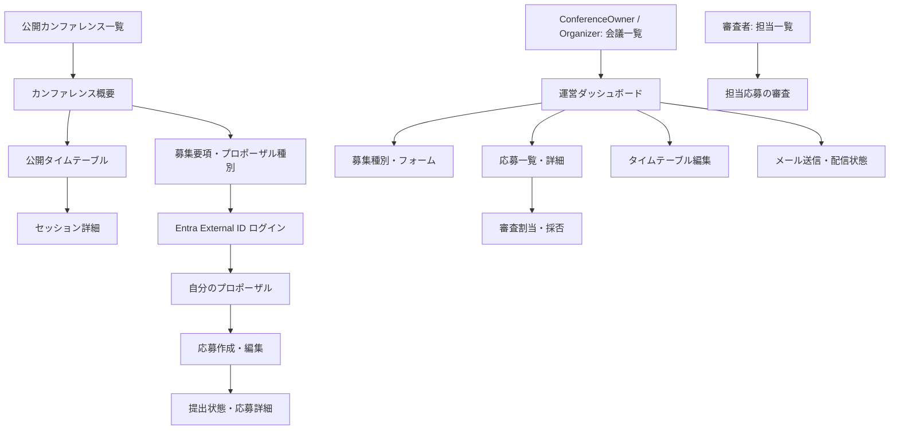

# 画面設計

- 状態: 初期設計案
- 対象: Blazor WebAssembly の公開閲覧者・Speaker・ConferenceOwner/Organizer・Reviewer 向け画面
- 関連: [全体アーキテクチャ](architecture.md)、[Cosmos DB データモデル](database-design.md)、[Functions クラス設計](function-class-design.md)
- 設計範囲: 情報構造、画面遷移、操作、権限、状態、レスポンシブ／アクセシビリティ要件
- 未決: ブランド、色、書体、具体的なビジュアル表現。Fluent UI Blazor v5 は実装候補であり、利用 API は package version 確定時に確認する。

## 1. 基本方針

- 公開閲覧、Speaker、ConferenceOwner/Organizer、Reviewer の利用体験を一つの Blazor WebAssembly アプリにまとめる。ヘッダーとナビゲーションは権限・作業文脈に応じて切り替える。
- 最初に行うことが明確になるよう、各画面の主操作は一つに絞り、補助操作はその近くに配置する。
- 公開情報と非公開情報の表示モデルを分離する。審査コメント、未公開プロポーザル、応募者の連絡先は、権限がない画面に読み込まない。
- 画面上のリンク・メニュー表示は認可の代替にしない。API が毎回利用者とカンファレンス単位の権限を検証する。
- 画面からの API 呼び出しは共通 client service に集約し、MemoryPack の request/response 変換と status/error 判定を画面 component に分散させない。
- 既存要件にあるメール通知・応募状態・採否・公開タイムテーブルを画面上の明示的な状態として扱う。非同期メールの「受付」と「配信成功」は区別する。

## 2. 情報構造と画面遷移



### 2.1 画面ルート

| ルート | 画面 | 主な利用者 |
|---|---|---|
| `/` | 公開カンファレンス一覧 | 公開閲覧者 |
| `/c/{slug}` | カンファレンス概要 | 公開閲覧者、応募者 |
| `/c/{slug}/cfp` | 募集要項・募集種別一覧 | 公開閲覧者、応募者 |
| `/c/{slug}/proposals` | 公開設定された採択プロポーザル一覧 | 公開閲覧者 |
| `/c/{slug}/proposals/{proposalId}` | 公開設定されたプロポーザル詳細 | 公開閲覧者 |
| `/c/{slug}/schedule` | 公開タイムテーブル | 公開閲覧者 |
| `/c/{slug}/sessions/{sessionId}` | セッション詳細・共有リンク | 公開閲覧者 |
| `/account/profile` | プロフィール・外部プロフィール URL | ログイン済み利用者 |
| `/my/proposals` | 自分の応募一覧 | スピーカー |
| `/my/proposals/{proposalId}` | 応募の確認・編集 | 応募者本人 |
| `/reviewer` | 担当審査一覧 | 審査スタッフ |
| `/reviewer/conferences/{conferenceId}/proposals/{proposalId}` | 審査詳細・評価入力 | 割当済み審査スタッフ |
| `/manage/conferences` | 管理対象カンファレンス一覧 | ConferenceOwner、Organizer |
| `/manage/conferences/new` | カンファレンス作成 | ログイン済み利用者 |
| `/manage/conferences/{conferenceId}` | 運営ダッシュボード | 当該会議の管理権限者 |
| `/manage/conferences/{conferenceId}/proposal-types` | 募集種別・フォーム設定 | 当該会議の管理権限者 |
| `/manage/conferences/{conferenceId}/proposals` | 応募一覧・絞り込み | 当該会議の管理権限者 |
| `/manage/conferences/{conferenceId}/proposals/{proposalId}` | 応募詳細・審査・採否 | 当該会議の管理権限者 |
| `/manage/conferences/{conferenceId}/reviewers` | 審査担当・割当管理 | 当該会議の管理権限者 |
| `/manage/conferences/{conferenceId}/schedule` | 会場・トラック・日程編集 | 当該会議の管理権限者 |
| `/manage/conferences/{conferenceId}/mail` | メール作成・送信履歴 | ConferenceOwner、Organizer |
| `/manage/conferences/{conferenceId}/members` | 主催者・スタッフ管理 | ConferenceOwner |
| `/manage/conferences/{conferenceId}/audit` | 操作履歴 | 当該会議の管理権限者 |

ログイン自体は Microsoft Entra External ID がホストする画面へ遷移する。Blazor アプリはログイン後の戻り先を保持し、パスワードや IdP の資格情報を独自に入力させない。ログイン完了後の権限は API で再確認する。

SNS 共有 URL は `/share/conferences/{slug}` 等の Functions HTML endpoint とする。SNS crawler 向け OGP metadata と公開情報だけを含め、Blazor の公開 URL への明示リンクを表示する。URL と metadata は公開済みデータだけから生成し、share endpoint を公開権限の迂回路にしない。

メンバー管理と owner 移譲は ConferenceOwner のみが実行できる。最後の owner を削除・降格する操作は拒否される。

### 2.2 ナビゲーション

- **公開シェル:** サービス名、カンファレンス検索、ログイン。カンファレンス内では「概要」「募集」「タイムテーブル」へ移動する。
- **スピーカーシェル:** 「自分の応募」「プロフィール」と現在のログイン状態を表示する。応募画面から公開 CFP に戻れるようにする。
- **管理シェル:** カンファレンス選択を常に識別できる位置に置き、「概要」「募集種別」「応募」「審査担当」「タイムテーブル」「メール」「メンバー」「監査」の順にまとめる。メンバー・監査は権限がある利用者だけに表示する。
- **審査シェル:** 担当審査一覧から審査対象へ移動し、審査中に他の管理機能を誤って操作しない構成にする。
- パンくずまたは明示的な戻り先を提供し、ブラウザーの戻る操作だけに依存しない。ページタイトルと見出しは遷移後に更新する。

## 3. 主要画面

### 3.1 公開カンファレンスと募集

**カンファレンス一覧**

- 公開中のカンファレンスを検索・ページング付きで表示する。カードにはタイトル、開催日、開催場所またはオンライン開催、募集状態を含める。
- 空状態では開催中の募集がないことを明示し、検索条件を解除できる。
- 選択するとカンファレンス概要へ移動する。

**概要・募集要項**

- カンファレンス名、開催日時・タイムゾーン、説明、募集状態、締切、問い合わせ先を先に示す。
- 募集中は「応募する」を主操作として、募集種別選択へ誘導する。締切後・非公開・公開前は状態と次に可能な操作を明示し、応募ボタンを表示しない。
- 募集種別ごとに説明、登壇時間、応募期間、提出項目の概要を示す。応募条件の詳細とフォーム入力を同じ画面に詰め込まない。
- 公開プロポーザルの閲覧はカンファレンスの公開設定に従う。未公開応募や審査情報は取得しない。
- 公開プロポーザル一覧は会議の showcase 設定が有効な場合だけ表示する。採択後、応募責任者が公開対象（タイトル・概要・登壇者名等）を確認し、共同登壇者全員の同意を得たことを明示的に表明する。主催者が個別公開した後に一覧・詳細・共有ページへ掲載する。

**公開タイムテーブル・セッション詳細**

- 日付、開始時刻、部屋／トラック、セッション名、登壇者を識別できる形で並べる。開催地のタイムゾーンを明記する。
- 公開タイムテーブル上の個々のセッション情報は、採択、応募責任者の同意、Organizer の個別公開がそろったものだけ表示する。同意撤回・非公開化後はタイムテーブルと session share から除外する。
- 広い画面では日付・トラックで構造化し、狭い画面では時刻順の一覧に切り替える。時間割の表を狭い画面へ縮小して読みにくくしない。
- セッション詳細に概要、時間、部屋、登壇者と公開プロフィール URL、共有リンクを表示する。公開済みデータだけを使う。

### 3.2 スピーカー

**プロフィール**

- 表示名、自己紹介、必要な連絡情報、任意の外部プロフィール URL を編集する。
- プロフィールや提案を公開する場合、公開範囲と同意状態を明示し、同意撤回時の非公開化手順を提供する。
- メールアドレスは認証用外部 ID と別に扱い、確認済み状態と `ConferenceOperations` 通知の opt-in を管理する。未確認アドレスにはメールを送らない。外部 URL は文字列のまま公開せず、サーバーでも形式と利用方針を検証する。

**応募一覧**

- 自分が所有する応募のみを表示し、カンファレンス、募集種別、状態、最終更新日時で識別できるようにする。
- 空状態から公開カンファレンス一覧へ移動できる。状態は色だけでなくテキストで示す。

**応募作成・編集**

1. カンファレンスと募集種別、受付状態、締切、提出条件を確認する。
2. タイトル・概要・詳細回答・登壇者を、公開されたフォーム定義に沿って入力する。
3. 入力内容をプレビューし、項目別エラーを修正する。
4. 「下書き保存」または「提出」を明示的に選ぶ。提出時は最終確認を行い、成功後に受付状態を表示する。

入力中は保存状態、必須項目、文字数制限を表示する。検証エラー後も入力値を保持し、エラー一覧から該当項目へ移動できる。複数登壇者の連絡先など、公開に不要な個人情報を追加収集しない。

採択済み提案には、公開する項目と共同登壇者の同意確認を示す公開同意操作を提供する。同意を撤回すると自サービス上の公開は直ちに解除され、再公開には同意と主催者承認の両方を再度必要とする。外部 SNS が取得済みの preview cache は即時消去を保証できない旨を同意前に説明する。

### 3.3 ConferenceOwner・Organizer

**カンファレンス作成と運営ダッシュボード**

- 作成画面は基本情報、開催・タイムゾーン、募集期間、公開 URL の順で入力し、公開前に全項目を確認する。
- ダッシュボードには会議の公開状態、CFP の募集状態、審査進行、締切、応募件数、未割当／未審査件数、未解決のメール失敗、タイムテーブル公開状態を別々に示す。
- 件数はページ読み込み時点の情報であることを表し、更新操作または再読み込みで最新状態を取得できる。
- 次に必要な作業へのリンクを提示するが、自動で公開・採否・メール送信を実行しない。

**募集種別・応募フォーム**

- 種別の追加・編集・受付状態変更を行う。フォーム項目は種類、ラベル、必須、文字数、選択肢を編集できる。
- 提出済み応募に使われているフォーム版を上書きしない。変更時は新バージョンとして扱う旨を表示する。
- 保存前に変更内容をプレビューし、受付中の種別を停止する場合は影響を確認する。

**応募一覧・詳細、審査・採否**

- 一覧は状態、募集種別、担当者で絞り込み、ページングする。初期表示は応募のタイトル、種別、状態、提出日時、審査進捗に限定する。
- 詳細では応募内容、登壇者情報、審査記録、操作履歴を権限に応じて別領域に表示する。
- 審査担当割当・利益相反確認・採否変更は確認画面を挟み、理由入力が必要な操作を明示する。
- 採択提案の公開は同意状態と公開対象を確認してから個別に実行する。同意が未取得または撤回済みの場合は公開操作を無効にする。
- 保存時の競合（別ユーザーの更新）は成功扱いにせず、最新データを読み直して差分を確認するよう案内する。

**審査者一覧・審査**

- 審査者は自分に割り当てられた提案だけを一覧で確認できる。
- 審査フォームは採点項目、評価コメント、利益相反申告を分け、保存済み／未提出を明確にする。
- ブラインド審査が有効な場合は応募者を識別できる情報を表示しない。権限外の直接 URL は API 側で拒否する。

**タイムテーブル編集**

- 会場、部屋、トラックを先に設定し、採択済み提案を時間枠に割り当てる。
- 部屋の重複、セッション時間との不一致、同一提案の重複配置を保存前に表示する。サーバーの競合検証も必須とする。
- ポインター操作による移動を追加する場合も、キーボードで同じ開始・終了時刻、部屋、トラックを編集できるフォームを用意する。
- 下書きプレビュー、公開、公開後の修正履歴を分ける。公開結果を閲覧者向け画面で確認できる。

**メールセンター**

- 宛先セグメントと対象人数、除外条件、テンプレート、件名、本文、送信者を確認する。
- 通信カテゴリを確認する。`ConferenceOperations` は recipient の明示 opt-in がある場合だけ送信対象にし、`Transactional` は受付・採否などの必要連絡に限る。
- プレビューと送信確認を必須とし、送信中は重複実行を防止する。大量送信時は対象範囲と件数を再確認する。
- 各通知を `Pending / Ready / Sending / Accepted / Delivered / Bounced / Suppressed / FilteredSpam / Quarantined / Failed / Unknown / Cancelled` で表示する。`Accepted` は受信者への配信完了を意味しない。
- `Delivered` は宛先側メールサーバーへの引き渡しを示す。バウンス、配信抑止、迷惑メール判定、隔離等はそれぞれ `Bounced / Suppressed / FilteredSpam / Quarantined` として表示し、結果不明の `Unknown` は自動再送せず運営者に照合を促す。
- 一括送信は宛先人数、本文、対象条件の固定 snapshot を再確認してから開始する。送信後に対象条件を再評価しない。
- 個人情報や審査メモを本文へ不要に複製しない。再送には対象・理由・実行者を記録する。

### 3.4 画面の低忠実度レイアウト例

公開募集:

```text
[メインへ移動] [サービス名] [カンファレンスを探す] [ログイン]
[カンファレンス名]                         [開催日・タイムゾーン]
[募集状態] [締切] [開催形式]
[概要]
[募集種別: 種別名 / 登壇時間 / 締切]        [応募する]
[募集条件・問い合わせ先]
```

運営ダッシュボード:

```text
[カンファレンス選択] [運営ナビゲーション]
[カンファレンス名] [公開状態] [次の締切]
[応募総数] [未審査] [要対応のメール] [日程公開状態]
[作業: 審査担当未割当] [作業: 日程未公開]
[最近の操作・状態変更]
```

応募フォーム:

```text
[カンファレンス / 募集種別] [フォームの段階]
[エラー概要（エラーがある場合）]
[入力項目と説明・制約]
[登壇者・共同登壇者]
[下書き保存] [入力内容を確認] [提出]
```

これらは情報順序の確認用であり、色・書体・余白・具体的なコンポーネントは実装時に別途決定する。

## 4. 共通状態・エラー表示

| 状態 | 画面上の扱い |
|---|---|
| 初期ロード | レイアウトを保った読み込み表示と、支援技術向けの状態通知を行う。 |
| 空 | なぜ空かを説明し、許可される場合だけ次の操作を示す。 |
| 入力エラー | エラー概要と項目別の修正方法を表示し、該当欄に関連付ける。入力値は保持する。 |
| 未ログイン | 必要な操作とログイン先を説明し、ログイン後の戻り先を保持する。 |
| 権限なし | 権限がない旨を説明し、機密データの存在や内容を漏らさない。 |
| 対象なし | 削除済み・未公開等の区別で情報を漏らさず、適切な一覧へ戻れるようにする。 |
| 通信・サービス失敗 | 成功形の空データに置き換えない。再試行可能性と問い合わせ用の相関 ID を表示する。 |
| 更新競合 | 競合したことを通知し、最新状態を再読込してから操作をやり直せるようにする。 |
| 成功 | 完了した操作と次の状態を表示し、二重送信を避ける。 |

## 5. レスポンシブとアクセシビリティ

- WCAG 2.2 AA を設計・実装の目標とし、達成済みとは見なさない。W3C の達成基準を実画面で検証する。
- 日本語 `lang`、見出し階層、`header` / `nav` / `main` 等のランドマーク、ページタイトル、スキップリンクを適切に使う。
- すべての機能をキーボードで操作できるようにし、論理的な Tab 順、明確なフォーカス、ダイアログ終了後のフォーカス復帰を設計する。
- フォームは可視ラベル、必須状態、入力例、エラー説明を関連付ける。動的な保存・送信状態は適切な live region で通知し、通知だけでなく画面内にも残す。
- 採否、エラー、選択、締切状態は色だけで表現しない。拡大・狭い画面でも操作と情報が失われないようにする。
- タイムテーブルや応募一覧は狭い画面で読み順が保たれる。ドラッグ操作にはキーボード・フォーム代替を用意する。
- 自動検査に加え、キーボード操作、スクリーンリーダー、拡大表示、reflow、forced-colors、reduced motion を実装後に確認する。

## 6. 未決事項

- UI のビジュアル方向、プロダクト名、ロゴ、色、書体。
- 日本語以外の UI 対応と公開コンテンツの多言語運用。
- お気に入りとブラインド審査をカンファレンス設定として有効化するか。
- フォームの自動保存、ファイル添付、複数人での同時編集の要否。
- 想定する応募件数・一括メール件数・利用端末比率。実データや運用実績がないため、画面の具体的な件数・イベント情報を事実として作らない。

## 7. 参照資料

- [全体アーキテクチャ](architecture.md)
- [Cosmos DB データモデル](database-design.md)
- [Functions クラス設計](function-class-design.md)
- [W3C WAI: WCAG 日本語](https://www.w3.org/WAI/standards-guidelines/wcag/ja)
- [Microsoft Learn: Secure ASP.NET Core Blazor WebAssembly](https://learn.microsoft.com/aspnet/core/blazor/security/webassembly/)
